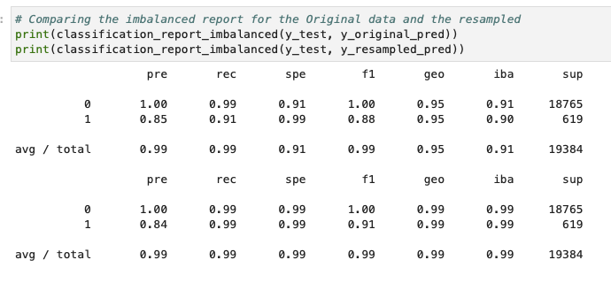

# Credit Risk Resampling Analysis

In this application, we performed credit risk analysis using supervised machine learning techniques.

The purpose of the analysis was to to build a model that can predict the creditworthiness of borrowers using a dataset of historical lending activity.

---

## Technologies

This project was developed with python 3.7 with the following packages:

* [pandas](https://github.com/pandas-dev/pandas) - Providing fast, flexible, and expressive data structures designed to make working with "relational" or "labeled" data both easy and intuitive.

* [Numpy](https://github.com/numpy/numpy) - NumPy is the fundamental package for scientific computing with Python, providing a powerful N-dimensional array object, sophisticated (broadcasting) functions, tools for integrating C/C++ and Fortran code, useful linear algebra, Fourier transform, and random number capabilities.

* [Pathlib](https://docs.python.org/3/library/pathlib.html) - The pathlib is a Python module which provides an object API for working with files and directories. The pathlib is a standard module. Path is the core object to work with files.

* [SKLearn](https://github.com/scikit-learn/scikit-learn) - SPython module for machine learning built on top of SciPy and is distributed under the 3-Clause BSD license.

* [Imbalanced-Learn](https://imbalanced-learn.org/stable/) - Imbalanced-learn (imported as imblearn) is an open source, MIT-licensed library relying on scikit-learn (imported as sklearn) and provides tools when dealing with classification with imbalanced classes.


Also, I used [Jupyter Lab](https://github.com/jupyter/notebook)  notebook to develope it.

---

## Installation Guide

Before running the application it is necessary to install the following dependencies.

* pandas
```conda install pandas``` 
* Jupyter Notebook
```pip install notebook```
* Numpy
```pip install numpy```
* Pathlib
```pip install pathlib```
* imbalanced-learn
```pip install -U imbalanced-learn```
* SKLearn
```pip install -U scikit-learn```
---

## Usage

To use the application you will need to clone the repo into your machine, navigate on terminal into it and open your [Jupyter Lab](https://github.com/jupyter/notebook) to run the file **credit_risk_resampling.ipynb**. 

Bellow you can find a brief summary of the data collected through the analysis for the forecasts (daily, weekly, yearly and trend) .
 

---

## Contributors

This was a project developed as a group during a Fintech Bootcamp hosted by UC Berkley Extension. 

---

## License
MIT


HAPPY CODING :) 

